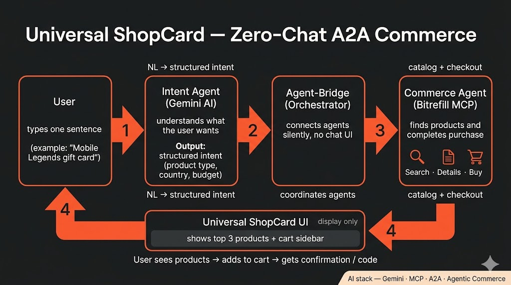

# Universal ShopCard (USC)

**Universal ShopCard** is a zero-chat, single-prompt commerce UI for the [Bitrefill 2026 hackathon](https://stadium.joinwebzero.com/programs/bitrefill-2026). The user types one travel or shopping need; the backend Agent-Bridge parses intent with Gemini, queries the Bitrefill catalog, returns the top 3 products, and handles checkout via developer balance or a free test product.



---

## Stack & ports

| Layer | Tech | Port |
|-------|------|------|
| Frontend | React 19, TypeScript, Vite, vanilla CSS | `3000` (Docker) / `5173` (dev) |
| Backend | Node.js, Express, TypeScript, Gemini SDK | `5000` (local dev only) |
| External | Bitrefill API v2 (same backend as MCP tools) | `https://api.bitrefill.com/v2` |

In Docker, only the frontend is exposed on port **3000**. Nginx proxies `/api/*` and `/health` to the backend container on the internal network.

---

## User flow

1. **Intent** — User submits one prompt (e.g. `test gift card` or `Mobile Legends diamonds in Philippines`).
2. **Parse** — Gemini extracts country + search terms (with offline regex fallback when quota is exhausted).
3. **Search** — Backend queries Bitrefill API v2 for products; returns exactly **top 3**.
4. **ShopCard** — User adds items to the sticky **Universal ShopCard** sidebar.
5. **Checkout** — `POST /api/checkout` creates an invoice. Default payment is **developer balance** (`BITREFILL_PAYMENT_METHOD=balance`).
6. **Demo fallback** — If API developer balance is empty, checkout automatically uses the free **`test-gift-card-code`** product ($0) so demos still complete.

---

## Payment modes

| Mode | Env | Behavior |
|------|-----|----------|
| Developer balance | `BITREFILL_PAYMENT_METHOD=balance` | Debits your [Bitrefill developer API balance](https://www.bitrefill.com/account/developers) — not your personal wallet |
| Bitcoin invoice | `BITREFILL_PAYMENT_METHOD=bitcoin` | Returns QR / payment URI for external settlement |
| Free demo | `BITREFILL_INCLUDE_TEST_PRODUCTS=true` + empty balance | Backend auto-purchases `test-gift-card-code` on balance checkout |

Use `BITREFILL_API_KEY=mock` for offline catalog only (no live checkout).

---

## Environment

Copy `.env.example` to `.env` at the **project root** (not `backend/.env`):

```env
GEMINI_API_KEY=...
GEMINI_MODEL=gemini-2.0-flash
GEMINI_OFFLINE_ONLY=false          # true = skip Gemini (use when free-tier quota is exhausted)

BITREFILL_API_KEY=...              # real key for live catalog + checkout
BITREFILL_API_V2_URL=https://api.bitrefill.com/v2
BITREFILL_PAYMENT_METHOD=balance
BITREFILL_BALANCE_CURRENCY=USD     # EUR | USD | XBT
BITREFILL_INCLUDE_TEST_PRODUCTS=true
BITREFILL_ENABLE_PAYMENT=true

PORT=5000
FRONTEND_URL=http://localhost:3000
```

Never commit `.env` or log API keys.

---

## Run

### Docker (recommended)

```bash
docker compose up --build
```

Open **http://localhost:3000**.

### Local development

**Backend** (terminal 1):

```bash
cd backend
npm install
npm run dev
```

Runs on **http://localhost:5000**.

**Frontend** (terminal 2):

```bash
cd frontend
npm install --legacy-peer-deps
npm run dev
```

Runs on **http://localhost:5173** and calls `http://localhost:5000` by default (`VITE_API_BASE`).

---

## API

| Route | Body | Returns |
|-------|------|---------|
| `POST /api/intent` | `{ prompt: string }` | `{ success, country, products[] }` |
| `POST /api/checkout` | `{ items: [{ productId, packageId }], paymentMethod? }` | `{ success, invoices[] }` |
| `GET /api/balance` | — | `{ balance, currency }` |
| `GET /health` | — | `{ status: "ok" }` |

---

## Project structure

```
universal-shopcard/
├── .env.example
├── AGENTS.md                 # Cursor agent context
├── docs/
│   └── usc-architecture-diagram.jpg
├── docker-compose.yml
├── backend/src/
│   ├── index.ts              # Express entry, startup balance log
│   ├── config/env.ts         # Root .env loading
│   ├── routes/api.ts         # Intent, checkout, balance
│   └── services/
│       ├── gemini.service.ts # Intent parsing + offline fallback
│       └── mcp.service.ts    # Bitrefill API v2 client
└── frontend/src/
    ├── App.tsx               # State + API calls
    └── components/
        ├── PromptInput.tsx
        ├── ProductCard.tsx
        └── ShopCard.tsx      # Cart, balance display, checkout modal
```

---

## Demo tips

- Search **`test gift card`** to surface the free test product directly.
- With `BITREFILL_INCLUDE_TEST_PRODUCTS=true`, any checkout succeeds via the free test product when developer balance is $0.
- Paid products (e.g. Mobile Legends ~$0.20) require funded developer balance at [bitrefill.com/account/developers](https://www.bitrefill.com/account/developers).
- Set `GEMINI_OFFLINE_ONLY=true` if Gemini returns 429 quota errors; intent parsing still works via regex fallback.

---

## Quality checks

```bash
cd backend && npm run build && npm run lint
cd frontend && npm run build && npm run lint
```

---

## License

See [LICENSE](LICENSE).
